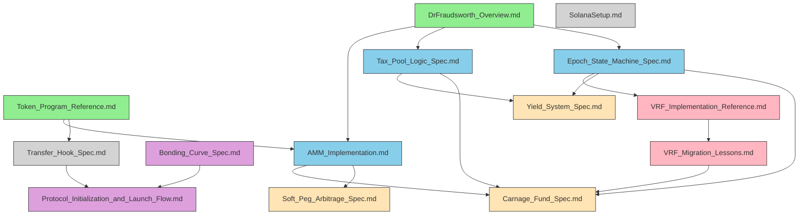

# Document Inventory

## Dashboard

| Metric | Count |
|--------|-------|
| Total Documents | 14 |
| Total Concepts | 85 |
| Audited | 14 |
| Pending | 0 |
| Open Conflicts | 0 |
| Open Gaps | 0 |
| Current Iteration | 4 |
| Clean Passes | 3 |

**Convergence:** Phase 5 achieved convergence (2 clean passes on 12 documents). Phase 7 extended validation to 14-document scope (1 additional clean pass).
**Last Updated:** 2026-02-03

---

## Concept Summary

| Type | Count | ID Range |
|------|-------|----------|
| Constants | 15 | CONST-001 to CONST-015 |
| Entities | 14 | ENT-001 to ENT-014 |
| Behaviors | 16 | BEH-001 to BEH-016 |
| Constraints | 14 | CONSTR-001 to CONSTR-014 |
| Formulas | 8 | FORM-001 to FORM-008 |
| Terminology | 10 | TERM-001 to TERM-010 |
| Assumptions | 8 | ASSUMP-001 to ASSUMP-008 |
| **Total** | **85** | |

**Inventory:** `.planning/cross-reference/00-concept-inventory.md`

> **Note:** 85 concepts from 12 original spec documents. VRF reference documents (2) contain additional implementation concepts outside the spec-level inventory scope.

---

## Dependency Graph

---

## Document Inventory

### Foundation Documents

_Documents that other specs depend on but have no upstream dependencies._

| Document | Purpose | Status | Key Concepts |
|----------|---------|--------|--------------|
| DrFraudsworth_Overview.md | System overview and narrative (meta-document, updated through Phase 5) | Audited | Token structure, fee/tax overview, carnage mechanics, protocol invariants |
| Token_Program_Reference.md | Canonical token program matrix (NEW from Phase 2) | Audited | WSOL/T22 distinction, hook support matrix |

### Core Specifications

_Implementation-focused specs for major subsystems._

| Document | Purpose | Status | Key Concepts |
|----------|---------|--------|--------------|
| Epoch_State_Machine_Spec.md | Timing and state coordination | Audited | 4,500 slots/epoch, VRF integration, state transitions |
| Tax_Pool_Logic_Spec.md | Tax collection and distribution | Audited | Tax regime (1-14%), distribution split (75/24/1) |
| AMM_Implementation.md | Swap mechanics and pool operations | Audited | Constant-product formula, Tax Program signature requirement |

### Dependent Specifications

_Specs that depend on multiple upstream documents._

| Document | Purpose | Status | Key Concepts |
|----------|---------|--------|--------------|
| Carnage_Fund_Spec.md | Chaos/deflation mechanism | Audited | 1/24 probability, 98%/2% burn/sell split, two-instruction atomic bundle |
| New_Yield_System_Spec.md | PROFIT yield distribution | Audited | Checkpoint model, auto-claim, ghost yield prevention |
| Soft_Peg_Arbitrage_Spec.md | CRIME/FRAUD peg mechanics | Audited | No-arbitrage band, loop mechanics |

### Launch Specifications

_Token launch and deployment sequence._

| Document | Purpose | Status | Key Concepts |
|----------|---------|--------|--------------|
| Bonding_Curve_Spec.md | Pre-pool launch phase | Audited | Linear curve, 48-hour deadline, pool seeding |
| Protocol_Initialzation_and_Launch_Flow.md | Deployment sequence | Audited | 4-phase deployment, authority burn |

### VRF Reference

_Switchboard VRF implementation reference and migration lessons from v3-archive._

| Document | Purpose | Status | Key Concepts |
|----------|---------|--------|--------------|
| VRF_Implementation_Reference.md | Switchboard On-Demand VRF technical reference (from v3-archive) | Audited | Three-transaction lifecycle, commit-reveal, anti-reroll security |
| VRF_Migration_Lessons.md | VRF migration pitfalls and spec discrepancy register | Audited | 6 pitfalls, 7 DISC entries resolved as SPEC |

### Infrastructure

_Development environment and token infrastructure._

| Document | Purpose | Status | Key Concepts |
|----------|---------|--------|--------------|
| Transfer_Hook_Spec.md | Token transfer restrictions | Audited | Whitelist enforcement (13 entries), authority burn |
| SolanaSetup.md | Development environment | Audited | Minimal protocol concepts (devnet config) |

---

## V3 Archive Reference

_Legacy reference from archive-V3 branch. NOT authoritative - reference only._

(VRF implementation patterns captured in Phase 6)

---

## Cross-Reference Summary

**Concept Inventory:** 85 concepts across 7 types (Constants, Entities, Behaviors, Constraints, Formulas, Terminology, Assumptions)

**Matrices Built:** 6 category-split matrices

**Conflicts Detected:** 0 total (0 CRITICAL, 0 HIGH, 0 MEDIUM, 0 LOW)

**Assumptions Validated:** 8/8 - all assumptions checked against explicit constraints, no conflicts found

**Single-Source Concepts:** 22 flagged for Phase 4 gap analysis

See: `.planning/cross-reference/` for full matrices
See: `.planning/audit/CONFLICTS.md` for conflict registry

---

## Audit Progress by Phase

| Phase | Documents Covered | Status |
|-------|-------------------|--------|
| 1. Preparation | - | Complete |
| 2. Token Program Audit | Token_Program_Reference.md | Complete |
| 3. Cross-Reference | All 12 original documents (85 concepts) | Complete - 0 conflicts detected |
| 4. Gap Analysis | All 12 original documents (24 gaps found) | Complete |
| 5. Convergence | All 12 original documents (24 gaps filled) | Complete - 2 clean passes |
| 6. VRF Documentation | VRF_Implementation_Reference.md, VRF_Migration_Lessons.md, Carnage_Fund_Spec.md | Complete |
| 7. Validation | All 14 documents (delta validation) | Complete - clean pass |
