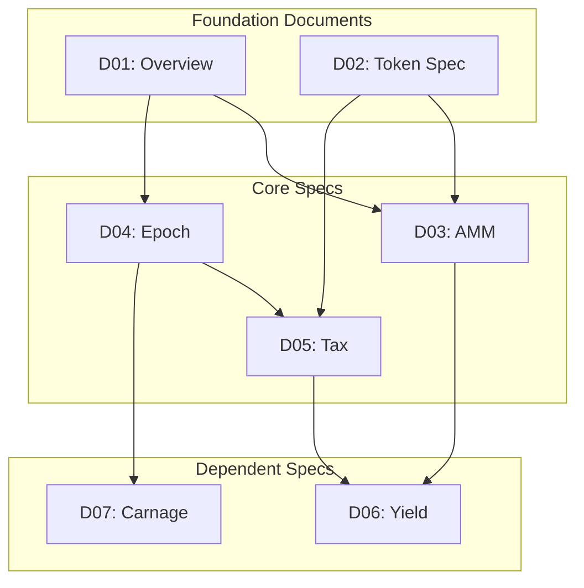
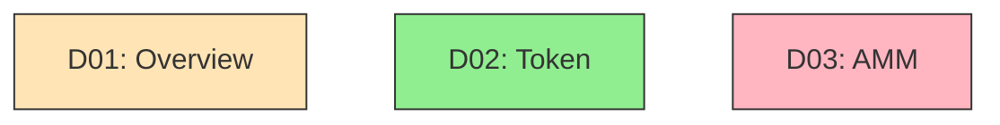

# Phase 1: Preparation - Research

**Researched:** 2026-02-01
**Domain:** Documentation Audit Infrastructure (Markdown-based tracking systems)
**Confidence:** HIGH

## Summary

Phase 1 creates the infrastructure to track a systematic documentation audit. The deliverables are four markdown files: INDEX.md (document inventory with dependency graph), CONFLICTS.md (conflict tracking), GAPS.md (gap tracking), and ITERATIONS.md (iteration log). This is a process/methodology phase, not a code implementation phase.

The research focused on three areas: (1) Mermaid diagram syntax for dependency graphs, (2) audit tracking document structure best practices, and (3) applying the decisions captured in 01-CONTEXT.md to create specific templates. The existing research in `.planning/research/` provides comprehensive coverage requirements and standards that inform the tracking document structures.

**Primary recommendation:** Use the templates and patterns defined below directly. The structure is constrained by CONTEXT.md decisions (rich metadata, quote-level specificity, 14-category gaps, full audit trails, 2-clean-pass convergence).

## Standard Stack

The established tools for this phase:

### Core
| Tool | Version | Purpose | Why Standard |
|------|---------|---------|--------------|
| Markdown | CommonMark | Document format | Universal, git-friendly, readable |
| Mermaid | 11.x | Dependency graphs | GitHub-native, text-based, version-controllable |
| Git | Any | Version control | Change tracking, audit trail |

### Supporting
| Tool | Purpose | When to Use |
|------|---------|-------------|
| VS Code Mermaid Preview | Live diagram editing | When creating/editing dependency graphs |
| mermaid.live | Diagram validation | When debugging complex graphs |

### Alternatives Considered
| Instead of | Could Use | Tradeoff |
|------------|-----------|----------|
| Mermaid | PlantUML | PlantUML more powerful but less GitHub-native |
| Markdown tables | YAML/JSON | Structured data better for automation but less readable |

**No installation required** - all tools are built into the development environment.

## Architecture Patterns

### Recommended Directory Structure
```
.planning/
├── audit/                    # Audit tracking documents
│   ├── INDEX.md             # Document inventory + dependency graph
│   ├── CONFLICTS.md         # Conflict log
│   ├── GAPS.md              # Gap log
│   └── ITERATIONS.md        # Iteration tracking
└── research/                # Existing research (read-only reference)
    ├── COVERAGE.md          # 14-category checklist
    ├── STANDARDS.md         # Documentation standards
    └── ...
```

### Pattern 1: Dashboard-First Document Structure

**What:** Every tracking document opens with a summary dashboard showing current state at a glance.

**When to use:** All audit tracking documents (INDEX.md, CONFLICTS.md, GAPS.md, ITERATIONS.md)

**Why:** From CONTEXT.md - "Dashboard view at top - docs audited, conflicts open, gaps remaining, current iteration"

**Example:**
```markdown
# Document Inventory (INDEX.md)

## Dashboard

| Metric | Count |
|--------|-------|
| Total Documents | 11 |
| Audited | 0 |
| Pending | 11 |
| Open Conflicts | 0 |
| Open Gaps | 0 |
| Current Iteration | 0 |

**Last Updated:** 2026-02-01
**Audit Phase:** Preparation
```

### Pattern 2: Rich Metadata Document Entries

**What:** Each document entry includes comprehensive metadata beyond just name and path.

**When to use:** INDEX.md document inventory

**Why:** From CONTEXT.md - "Metadata per doc: Rich - name, path, dependencies, primary topics, last modified, word count, key concepts defined, external references, audit status"

**Example:**
```markdown
### D01: Overview

| Field | Value |
|-------|-------|
| Path | `docs/overview.md` |
| Status | Draft |
| Last Modified | 2026-01-15 |
| Word Count | 2,450 |
| Audit Status | Not Started |
| Last Audit Phase | - |

**Dependencies:** None (foundation document)
**Dependents:** D02, D03, D04, D05, D06, D07, D08, D09, D10

**Primary Topics:**
- Protocol vision
- Token economics overview
- System architecture summary

**Key Concepts Defined:**
- IPA, IPB, OP4 tokens
- Epoch system
- Tax mechanism
- Carnage events

**External References:**
- Solana documentation
- Token-2022 program
```

### Pattern 3: Mermaid Dependency Graph (TD/Top-Down)

**What:** Visual dependency graph using Mermaid flowchart with TD (top-down) direction.

**When to use:** INDEX.md to show document relationships

**Why:** From CONTEXT.md - "Dependencies representation: Likely visual Mermaid graph for overview"

**Example:**
```markdown
## Dependency Graph



**Node styling for audit status:**

```

### Pattern 4: Quote-Level Conflict Entries

**What:** Conflict entries include actual quoted text from both conflicting documents.

**When to use:** CONFLICTS.md for every logged conflict

**Why:** From CONTEXT.md - "Specificity: Quote-level - include actual quoted text from both docs showing the conflict (self-contained, auditable)"

**Example:**
```markdown
### CONF-001: LP Fee Rate Discrepancy

| Field | Value |
|-------|-------|
| Severity | HIGH |
| Type | Value Conflict |
| Domain | AMM/Fees |
| Status | Open |
| Discovered | Iteration 1 |
| Resolved | - |

**Document A (D01: Overview):**
> "LP fees are set at 1% for all pools"

**Document B (D06: AMM Spec):**
> "LP fee rate: 100 bps (1%) for SOL pools, 50 bps (0.5%) for OP4 pools"

**Conflict:** D01 states uniform 1% LP fees; D06 specifies different rates per pool type.

**Impact:** Implementation would use wrong fee rate for OP4 pools if following D01.

**Resolution:** TBD
**Rationale:** TBD
**Documents Updated:** TBD
```

### Pattern 5: Category-Based Gap Entries

**What:** Gaps categorized by the 14-category coverage checklist with priority levels.

**When to use:** GAPS.md for every logged gap

**Why:** From CONTEXT.md - "Categorization: By checklist category - use the 14-category coverage checklist from research"

**Example:**
```markdown
### GAP-001: Missing Token Program Matrix

| Field | Value |
|-------|-------|
| Category | 1. Token Program Compatibility |
| Priority | HIGH |
| Document | D03: AMM Spec |
| Status | Open |
| Discovered | Iteration 1 |
| Filled | - |

**What's Missing:** Explicit token program matrix showing which program (SPL vs T22) for each side of each pool.

**Why It Matters:** V3 failure root cause - undocumented token program assumptions led to WSOL handling errors.

**Suggested Content:**
| Pool | Token A | Program A | Token B | Program B |
|------|---------|-----------|---------|-----------|
| IPA/SOL | IPA | T22 | WSOL | SPL |
| ... | ... | ... | ... | ... |

**Related Concepts:** ATA derivation, transfer instructions, hook coverage

**Resolution:** TBD
**Location Filled:** TBD
```

### Pattern 6: Full Iteration Detail Logging

**What:** Each iteration logged with comprehensive statistics and specific issue lists.

**When to use:** ITERATIONS.md for every audit iteration

**Why:** From CONTEXT.md - "Per-iteration logging: Full detail - summary stats + specific issues list + patterns observed + decisions made + blockers hit"

**Example:**
```markdown
### Iteration 1

**Date:** 2026-02-05
**Phase:** Cross-Reference Audit

#### Summary Statistics

| Metric | New | Resolved | Total Open |
|--------|-----|----------|------------|
| Conflicts | 5 | 0 | 5 |
| Gaps | 12 | 0 | 12 |

#### Issues Found

**Conflicts:**
- CONF-001: LP Fee Rate Discrepancy (HIGH)
- CONF-002: Tax Distribution Percentages (CRITICAL)
- ...

**Gaps:**
- GAP-001: Missing Token Program Matrix (HIGH)
- GAP-002: Missing CPI Depth Analysis (MEDIUM)
- ...

#### Patterns Observed

- D01 (Overview) consistently shows older values than implementation specs
- Token program handling underdocumented across all pool-related specs
- State machine "during wait" behaviors consistently missing

#### Decisions Made

- D01-D10 implementation specs are authoritative over D01 Overview for conflicts
- Token program matrix will be added to D02 (Token Spec) as canonical source

#### Blockers

- None

#### Convergence Status

| Criterion | Status |
|-----------|--------|
| All conflicts resolved | No (5 open) |
| All gaps filled | No (12 open) |
| Clean passes | 0 of 2 required |
```

### Anti-Patterns to Avoid

- **Vague conflict descriptions:** "D01 and D02 disagree about fees" - must include actual quotes
- **Missing priority justification:** Gaps without explaining why that priority level
- **Incomplete iteration logs:** Skipping pattern observations or decisions made
- **Orphan issues:** Conflicts/gaps without iteration discovery tracking
- **Dashboard drift:** Forgetting to update dashboard counts after changes

## Don't Hand-Roll

Problems that look simple but have established patterns:

| Problem | Don't Build | Use Instead | Why |
|---------|-------------|-------------|-----|
| Dependency visualization | ASCII art trees | Mermaid flowcharts | GitHub-native rendering, maintainable |
| Issue numbering | Manual incrementing | CONF-XXX, GAP-XXX pattern | Consistent, searchable, traceable |
| Status tracking | Free-text states | Enum: Open/Resolved/Won't-Fix | Enables filtering, statistics |
| Severity levels | Ad-hoc descriptions | CRITICAL/HIGH/MEDIUM/LOW | Consistent prioritization |
| Audit trail | Comments in docs | Explicit fields per entry | Queryable, complete |

**Key insight:** The tracking documents ARE the process. If they're poorly structured, the audit process fails. The templates below encode best practices into the document structure itself.

## Common Pitfalls

### Pitfall 1: Dashboard Staleness

**What goes wrong:** Dashboard counts don't match actual content after updates.
**Why it happens:** Manual counting, forgetting to update after resolving issues.
**How to avoid:** Update dashboard FIRST when modifying any entry. Consider adding "Last Updated" timestamp.
**Warning signs:** Dashboard says "0 open conflicts" but scrolling shows open entries.

### Pitfall 2: Dependency Graph Drift

**What goes wrong:** Mermaid graph doesn't reflect actual document dependencies.
**Why it happens:** Graph created once and never updated as understanding evolves.
**How to avoid:** Review graph each iteration. Add/remove edges as dependencies discovered.
**Warning signs:** Documents reference each other but no edge in graph.

### Pitfall 3: Quote Rot

**What goes wrong:** Quoted text in conflicts doesn't match current document state.
**Why it happens:** Source document updated but conflict entry not refreshed.
**How to avoid:** When resolving conflicts, verify quotes still accurate. Mark resolution iteration.
**Warning signs:** Quote references line number that no longer contains that text.

### Pitfall 4: Category Misattribution

**What goes wrong:** Gap categorized under wrong coverage category.
**Why it happens:** Categories have overlap (e.g., "Token Compatibility" vs "Security").
**How to avoid:** Use primary category based on what's MISSING, not where impact felt.
**Warning signs:** Same gap could fit 3+ categories equally well - pick most specific.

### Pitfall 5: Premature Convergence Declaration

**What goes wrong:** Declaring "clean pass" when issues remain or new ones lurk.
**Why it happens:** Fatigue, pressure to finish, missing verification step.
**How to avoid:** Convergence requires: (1) zero open issues AND (2) TWO consecutive clean passes.
**Warning signs:** Single clean pass followed by "done!" declaration.

## Code Examples

### INDEX.md Complete Template

```markdown
# Document Inventory

## Dashboard

| Metric | Count |
|--------|-------|
| Total Documents | 0 |
| Audited | 0 |
| Pending | 0 |
| Open Conflicts | 0 |
| Open Gaps | 0 |
| Current Iteration | 0 |
| Clean Passes | 0 |

**Convergence:** Not started
**Last Updated:** YYYY-MM-DD

---

## Dependency Graph

```mermaid
flowchart TD
    classDef audited fill:#90EE90,stroke:#333
    classDef pending fill:#FFE4B5,stroke:#333
    classDef conflict fill:#FFB6C1,stroke:#333

    %% Nodes added as documents inventoried
```

---

## Document Inventory

### Foundation Documents

_Documents that other specs depend on but have no upstream dependencies._

(Entries added during Phase 2: Token Program Audit)

### Core Specifications

_Implementation-focused specs for major subsystems._

(Entries added during Phase 2)

### Dependent Specifications

_Specs that depend on multiple upstream documents._

(Entries added during Phase 2)

---

## V3 Archive Reference

_Legacy reference from archive-V3 branch. NOT authoritative - reference only._

(VRF implementation patterns captured in Phase 6)

---

## Audit Progress by Phase

| Phase | Documents Covered | Status |
|-------|-------------------|--------|
| 1. Preparation | - | Current |
| 2. Token Program Audit | TBD | Pending |
| 3. Cross-Reference | TBD | Pending |
| 4. Gap Analysis | TBD | Pending |
| 5. Convergence | TBD | Pending |
| 6. VRF Documentation | TBD | Pending |
| 7. Validation | TBD | Pending |
```

### CONFLICTS.md Complete Template

```markdown
# Conflict Tracking

## Dashboard

| Severity | Open | Resolved | Total |
|----------|------|----------|-------|
| CRITICAL | 0 | 0 | 0 |
| HIGH | 0 | 0 | 0 |
| MEDIUM | 0 | 0 | 0 |
| LOW | 0 | 0 | 0 |
| **Total** | **0** | **0** | **0** |

**Last Updated:** YYYY-MM-DD

---

## Severity Definitions

| Level | Definition | Foundation Boost |
|-------|------------|------------------|
| CRITICAL | Breaks security or correctness | +1 if foundation doc |
| HIGH | Breaks functionality | +1 if foundation doc |
| MEDIUM | Inconsistency, no immediate breakage | - |
| LOW | Cosmetic, terminology | - |

---

## Conflict Types

| Type | Description |
|------|-------------|
| Value | Same parameter, different numeric values |
| Behavioral | Same flow, different sequences or outcomes |
| Assumption | Implicit dependencies, undocumented assumptions |

---

## Open Conflicts

_Conflicts awaiting resolution. Ordered by severity then discovery date._

(None yet - conflicts logged during Phase 3: Cross-Reference)

---

## Resolved Conflicts

_Conflicts that have been resolved with documentation updates._

(None yet)

---

## Won't Fix

_Conflicts acknowledged but intentionally not resolved, with rationale._

(None yet)
```

### GAPS.md Complete Template

```markdown
# Gap Tracking

## Dashboard

| Priority | Open | Filled | Won't Fill | Total |
|----------|------|--------|------------|-------|
| HIGH | 0 | 0 | 0 | 0 |
| MEDIUM | 0 | 0 | 0 | 0 |
| LOW | 0 | 0 | 0 | 0 |
| **Total** | **0** | **0** | **0** | **0** |

**Last Updated:** YYYY-MM-DD

---

## Gap Categories (14-Category Coverage Checklist)

| # | Category | Priority Baseline | Gaps Found |
|---|----------|-------------------|------------|
| 1 | Token Program Compatibility | HIGH | 0 |
| 2 | Account Architecture | HIGH | 0 |
| 3 | Mathematical Invariants | HIGH | 0 |
| 4 | Instruction Set | MEDIUM | 0 |
| 5 | CPI Patterns | HIGH | 0 |
| 6 | Authority & Access Control | HIGH | 0 |
| 7 | Economic Model | MEDIUM | 0 |
| 8 | State Machine Specifications | HIGH | 0 |
| 9 | Error Handling | MEDIUM | 0 |
| 10 | Event Emissions | LOW | 0 |
| 11 | Security Considerations | HIGH | 0 |
| 12 | Testing Requirements | MEDIUM | 0 |
| 13 | Deployment Specification | MEDIUM | 0 |
| 14 | Operational Documentation | LOW | 0 |

---

## Open Gaps

_Gaps awaiting documentation. Ordered by priority then category._

(None yet - gaps logged during Phase 4: Gap Analysis)

---

## Filled Gaps

_Gaps that have been addressed with new or updated documentation._

(None yet)

---

## Won't Fill

_Gaps acknowledged but intentionally not filled, with rationale._

(None yet)
```

### ITERATIONS.md Complete Template

```markdown
# Iteration Log

## Convergence Status

| Criterion | Required | Current |
|-----------|----------|---------|
| Open Conflicts | 0 | 0 |
| Open Gaps | 0 | 0 |
| Consecutive Clean Passes | 2 | 0 |

**Status:** Not converged
**Last Updated:** YYYY-MM-DD

---

## Convergence Definition

From CONTEXT.md:
1. All logged conflicts resolved
2. All logged gaps filled (or explicitly marked won't-fill with rationale)
3. Two consecutive verification passes find no new issues

---

## Iteration History

### Iteration 0: Preparation

**Date:** YYYY-MM-DD
**Phase:** 1 - Preparation

#### Summary

Audit infrastructure created. No documents audited yet.

#### Statistics

| Metric | New | Resolved | Total Open |
|--------|-----|----------|------------|
| Conflicts | 0 | 0 | 0 |
| Gaps | 0 | 0 | 0 |

#### Notes

- INDEX.md created with empty inventory
- CONFLICTS.md created with tracking structure
- GAPS.md created with 14-category framework
- ITERATIONS.md created (this file)

---

(Future iterations added below as audit progresses)
```

## State of the Art

| Old Approach | Current Approach | When Changed | Impact |
|--------------|------------------|--------------|--------|
| Spreadsheet tracking | Markdown + Git | 2020s | Version control, collaboration, portability |
| Manual diagrams | Mermaid text-based | Mermaid v8+ | Diagrams in version control, GitHub rendering |
| Single-pass review | Iterative convergence | Always best practice | Catches cascading issues |

**Deprecated/outdated:**
- Excel audit trackers: Poor version control, merge conflicts, not portable
- Image-based diagrams: Can't diff, hard to update, separate file management

## Open Questions

None - this phase is well-constrained by prior decisions in CONTEXT.md.

## Sources

### Primary (HIGH confidence)
- `.planning/research/COVERAGE.md` - 14-category coverage checklist (project-internal, authoritative)
- `.planning/research/STANDARDS.md` - Documentation standards (project-internal, authoritative)
- `.planning/research/SUMMARY.md` - Audit methodology (project-internal, authoritative)
- `01-CONTEXT.md` - User decisions constraining implementation (project-internal, authoritative)

### Secondary (MEDIUM confidence)
- [Mermaid Flowchart Syntax](https://mermaid.js.org/syntax/flowchart.html) - Official documentation
- [Mermaid GitHub](https://github.com/mermaid-js/mermaid) - Project repository
- [mermaid.live](https://mermaid.live/) - Live editor for validation

### Tertiary (LOW confidence)
- General audit tracking best practices from web search - informed structure but not Solana/DeFi-specific

## Metadata

**Confidence breakdown:**
- Standard stack: HIGH - Markdown/Mermaid is established, no alternatives needed
- Architecture: HIGH - Patterns derive directly from CONTEXT.md decisions
- Pitfalls: HIGH - Based on common documentation tracking failure modes

**Research date:** 2026-02-01
**Valid until:** Indefinite - this is process documentation, not technology that changes rapidly
