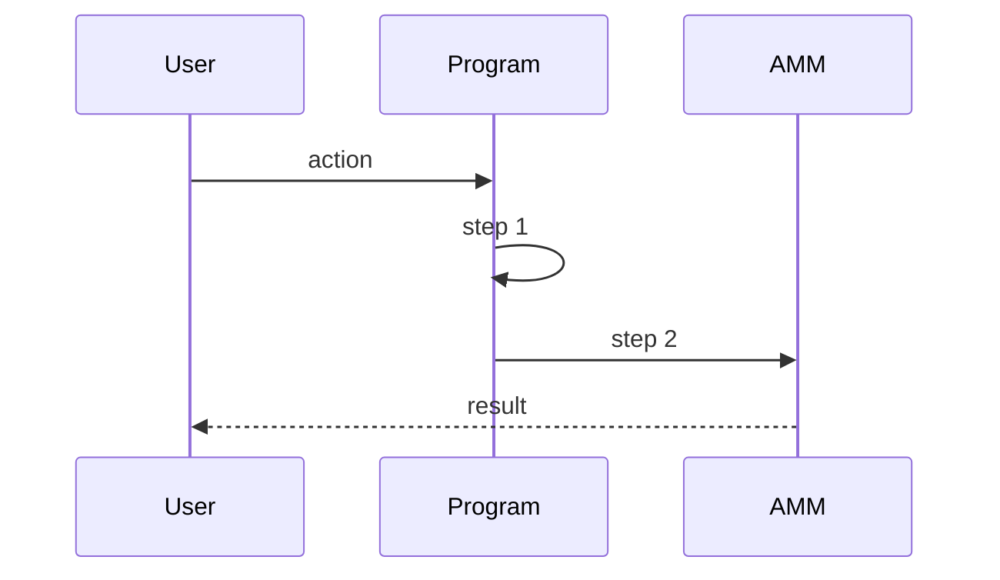
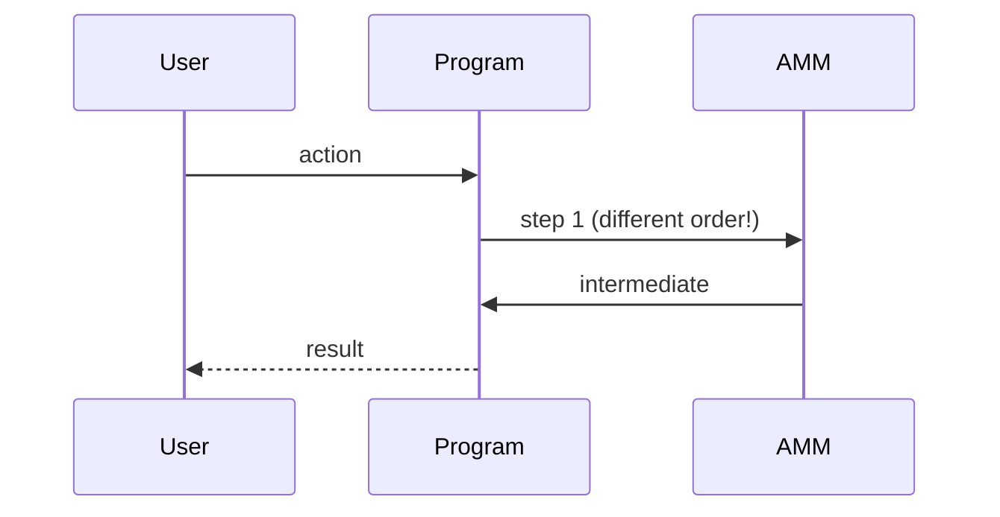

<objective>
Systematically detect and log all conflicts from the cross-reference matrices (value, behavioral, terminology) plus analyze assumptions against explicit constraints to detect assumption conflicts.

Purpose: This is the core detection phase. Every conflict logged here becomes input for Phase 5 (Convergence) resolution. The goal is exhaustive detection with clear documentation, NOT resolution - resolution is explicitly deferred.

Output: A complete conflict registry in CONFLICTS.md with formal entries for every detected conflict, ready for Phase 5 resolution work.
</objective>

<execution_context>
@./.claude/get-shit-done/workflows/execute-plan.md
@./.claude/get-shit-done/templates/summary.md
</execution_context>

<context>
@.planning/PROJECT.md
@.planning/ROADMAP.md
@.planning/STATE.md
@.planning/phases/03-cross-reference/03-CONTEXT.md
@.planning/phases/03-cross-reference/03-RESEARCH.md
@.planning/phases/03-cross-reference/03-01-SUMMARY.md
@.planning/phases/03-cross-reference/03-02-SUMMARY.md
</context>

<tasks>

<task type="auto">
  <name>Task 1: Detect and log value conflicts from constants/entities/formulas matrices</name>
  <files>.planning/audit/CONFLICTS.md</files>
  <action>
Scan 01-constants-matrix.md, 02-entities-matrix.md, and 05-formulas-matrix.md for all rows marked "DISCREPANCY".

**For each discrepancy, create a formal conflict entry:**

```markdown
### CONFLICT-[XXX]: [Descriptive Title]

**Concept:** [Concept ID from inventory, e.g., CONST-003]
**Type:** Value
**Severity:** [CRITICAL / HIGH / MEDIUM / LOW]
**Documents:** [List of conflicting docs]

#### What Differs

| Document | Value | Location |
|----------|-------|----------|
| [Doc A] | [value A] | :[section] |
| [Doc B] | [value B] | :[section] |

#### Why It Matters
[Explain the impact if this conflict is not resolved. What would break? What would be miscalculated?]

#### Resolution Options

**Option A:** Use [Doc A] value
- Reasoning: [Why this might be correct]
- Documents to update: [List]

**Option B:** Use [Doc B] value
- Reasoning: [Why this might be correct]
- Documents to update: [List]

**Recommended:** [Option A/B]
**Reasoning:** [Brief explanation]

---
```

**Severity classification (from 03-CONTEXT.md):**
- CRITICAL: Security impact OR incorrect runtime behavior
- HIGH: Implementation blocking OR wrong output (non-security)
- MEDIUM: Inconsistency, terminology difference, clarity issue
- LOW: Cosmetic, formatting, minor naming variance

**Foundation boost:** +1 severity if DrFraudsworth_Overview.md or Token_Program_Reference.md involved

**Important:**
- Apply semantic equivalence: 1% = 100 bps = 0.01 is NOT a conflict
- Different rounding presentations (1/24 vs 4.17% vs ~4%) may be conflicts depending on precision requirements
- If entity properties differ (e.g., pool ownership described differently), that's a value conflict
  </action>
  <verify>
- Every DISCREPANCY row in constants, entities, formulas matrices has corresponding CONFLICT entry
- Each conflict has all required fields: Concept, Type, Severity, Documents, What Differs, Why It Matters, Resolution Options
- Severity classifications follow the defined rules with foundation boost applied
- Conflict numbering is sequential (CONFLICT-001, CONFLICT-002, etc.)
  </verify>
  <done>All value conflicts from numeric/entity/formula matrices detected and logged with resolution options</done>
</task>

<task type="auto">
  <name>Task 2: Detect and log behavioral conflicts with Mermaid diagrams</name>
  <files>.planning/audit/CONFLICTS.md</files>
  <action>
Scan 03-behaviors-matrix.md for all rows marked "DISCREPANCY".

**For behavioral conflicts, use extended format with Mermaid diagrams:**

```markdown
### CONFLICT-[XXX]: [Descriptive Title]

**Concept:** [Concept ID, e.g., BEH-005]
**Type:** Behavioral
**Severity:** [CRITICAL / HIGH / MEDIUM / LOW]
**Documents:** [List of conflicting docs]
**Discrepancy Type:** [Order differs / Steps missing / Conditions differ / Outcomes differ]

#### Document A: [filename.md]

> "[Direct quote describing the sequence]"



#### Document B: [filename.md]

> "[Direct quote describing the sequence]"



#### Why It Matters
[Explain: What breaks if wrong sequence is implemented? User gets wrong output? Security issue? State corruption?]

#### Resolution Options

**Option A:** Follow Document A sequence
- Pros: [benefits]
- Cons: [tradeoffs]

**Option B:** Follow Document B sequence
- Pros: [benefits]
- Cons: [tradeoffs]

**Recommended:** [Option A/B]
**Reasoning:** [Detailed explanation, reference implementation constraints]
**Discussion Needed:** [Yes/No - yes if security implications or architectural impact]

---
```

**Key behavioral areas to check for conflicts:**
- Swap execution order (fee/tax/swap sequence)
- Epoch transition (VRF trigger -> callback -> tax application -> carnage check)
- Carnage execution (what triggers, what happens, in what order)
- Yield distribution (snapshot timing, merkle generation, claim process)
- Pool initialization sequence

Behavioral conflicts are often HIGH or CRITICAL severity because they directly affect execution correctness.
  </action>
  <verify>
- Every DISCREPANCY row in behaviors matrix has corresponding CONFLICT entry
- Each behavioral conflict includes TWO Mermaid diagrams (one per conflicting document)
- Discrepancy type is explicitly stated (Order/Steps/Conditions/Outcomes)
- "Discussion Needed" field populated for security-relevant conflicts
  </verify>
  <done>All behavioral conflicts detected and logged with comparative Mermaid diagrams</done>
</task>

<task type="auto">
  <name>Task 3: Detect assumption conflicts by cross-checking ASSUMP entries against constraints</name>
  <files>.planning/audit/CONFLICTS.md, .planning/cross-reference/00-concept-inventory.md</files>
  <action>
This is the most critical detection step. V3 failed due to an unstated assumption.

**Process:**

1. Load all ASSUMP-XXX entries from 00-concept-inventory.md
2. For each assumption, check against:
   - 04-constraints-matrix.md: Does any explicit constraint contradict this assumption?
   - Other ASSUMP entries: Do assumptions from different documents contradict each other?
   - Behavioral sequences: Does the assumed behavior contradict documented behavior?

**Assumption conflict entry format:**

```markdown
### CONFLICT-[XXX]: Assumption vs Reality - [Title]

**Concept:** [ASSUMP-XXX]
**Type:** Assumption
**Severity:** [Almost always CRITICAL or HIGH - assumptions are foundational]
**Assumption Source:** [Document that makes assumption]
**Contradicted By:** [Document(s) or constraint(s) that contradict]

#### The Assumption
> "[Quote or paraphrase of what's assumed]"

Inferred from: [How this assumption was identified]

#### The Contradiction
> "[Quote from contradicting document/constraint]"

Found in: [Location]

#### Why It Matters
[This is critical - assumptions that are wrong can cascade through entire system]
[Reference v3 failure pattern if applicable]

#### Resolution Options

**Option A:** The assumption is correct - update contradicting docs
- Impact: [What changes]
- Risk: [What could go wrong]

**Option B:** The assumption is wrong - update assuming docs
- Impact: [What changes]
- Risk: [What could go wrong]

**Option C:** Both need refinement - create clarifying documentation
- Impact: [What changes]
- Risk: [What could go wrong]

**Recommended:** [Option]
**Reasoning:** [Why this resolution makes sense]
**Discussion Needed:** Yes - assumption conflicts require careful review

---
```

**Specific assumption checks to perform:**

1. Token program assumptions:
   - "All tokens are Token-2022" - Check against Token_Program_Reference.md (WSOL exception)
   - "All pool sides have hook protection" - Check against hook coverage

2. Timing assumptions:
   - "Epoch transitions are atomic" - Check against VRF callback flow
   - "State is immediately available" - Check against slot timing

3. Authority assumptions:
   - "Only protocol can modify state" - Check against admin controls documented
   - "No external intervention possible" - Check against emergency mechanisms

4. Behavioral assumptions:
   - "Taxes apply to all swaps" - Check against OP4 pool behavior
   - "Carnage always executes atomically" - Check against fallback mechanisms

If an assumption has NO contradiction found, update its entry in 00-concept-inventory.md to mark it as "VALIDATED - no conflicts found".
  </action>
  <verify>
- Every ASSUMP-XXX entry has been checked against constraints and behaviors
- Assumption conflicts logged with extended format including both assumption and contradiction
- VALIDATED assumptions marked in concept inventory
- Severity for assumption conflicts is appropriate (typically CRITICAL or HIGH)
- "Discussion Needed: Yes" for all assumption conflicts (they're foundational)
  </verify>
  <done>All assumption conflicts detected through cross-checking against explicit constraints and behaviors</done>
</task>

<task type="auto">
  <name>Task 4: Update CONFLICTS.md dashboard and INDEX.md with final counts</name>
  <files>.planning/audit/CONFLICTS.md, .planning/audit/INDEX.md</files>
  <action>
**Update CONFLICTS.md dashboard:**

At the top of CONFLICTS.md, update the dashboard table:

```markdown
## Dashboard

| Severity | Open | Resolved | Total |
|----------|------|----------|-------|
| CRITICAL | [count] | 0 | [count] |
| HIGH | [count] | 0 | [count] |
| MEDIUM | [count] | 0 | [count] |
| LOW | [count] | 0 | [count] |
| **Total** | **[sum]** | **0** | **[sum]** |

**Last Updated:** [date] (Phase 3 Plan 03 complete)
```

Add summary section after dashboard:

```markdown
## Phase 3 Summary

**Detection complete:** [date]
**Conflicts by type:**
- Value conflicts: [count]
- Behavioral conflicts: [count]
- Assumption conflicts: [count]

**Discussion needed:** [count] conflicts require user review before resolution

**Next step:** Phase 5 (Convergence) will resolve these conflicts
```

**Update INDEX.md dashboard:**

- Open Conflicts: [total count from CONFLICTS.md]
- Current Iteration: 1
- Update Phase 3 status: "Complete - [X] conflicts detected"

**Add to INDEX.md a new section:**

```markdown
## Cross-Reference Summary

**Concept Inventory:** [count] concepts across 7 types
**Matrices Built:** 6 category-split matrices
**Conflicts Detected:** [count] total ([critical], [high], [medium], [low])

See: .planning/cross-reference/ for full matrices
See: .planning/audit/CONFLICTS.md for conflict registry
```
  </action>
  <verify>
- CONFLICTS.md dashboard counts match actual conflict entries (manually count to verify)
- INDEX.md "Open Conflicts" matches CONFLICTS.md total
- Phase 3 marked complete in INDEX.md audit progress
- Summary sections provide accurate counts by type
  </verify>
  <done>Dashboard and index updated with accurate conflict counts, Phase 3 status complete</done>
</task>

</tasks>

<verification>
After completing all tasks:
1. Every DISCREPANCY from all 6 matrices has a corresponding CONFLICT entry
2. All assumptions cross-checked against constraints (validated or conflicting)
3. Behavioral conflicts have Mermaid diagrams for both sides
4. Severity classifications correct with foundation boost applied
5. Resolution options provided for every conflict (even if "Discussion Needed")
6. Dashboard counts verified against actual entries
7. No unlogged conflicts from matrices (spot-check 3 random DISCREPANCY rows)
</verification>

<success_criteria>
- Complete conflict registry in CONFLICTS.md
- All three conflict types represented: Value, Behavioral, Assumption
- Each conflict has: type, severity, documents, what differs, why it matters, resolution options
- Behavioral conflicts have Mermaid diagrams
- Dashboard and INDEX.md accurately reflect conflict counts
- Phase 3 requirements XREF-03, XREF-04, XREF-05 fully satisfied
- Ready for Phase 5 resolution work
</success_criteria>

<output>
After completion, create `.planning/phases/03-cross-reference/03-03-SUMMARY.md`
</output>
