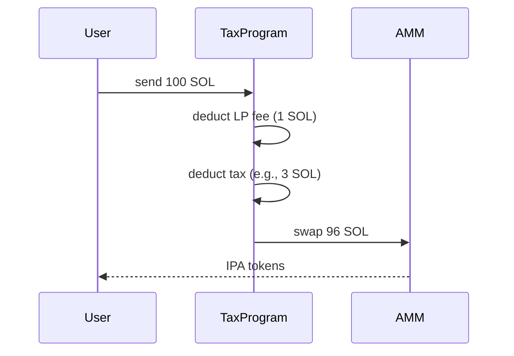

# Phase 3: Cross-Reference - Research

**Researched:** 2026-02-01
**Domain:** Specification Cross-Referencing and Conflict Detection
**Confidence:** HIGH

## Summary

Phase 3 extracts concepts from all 12 spec documents (11 original + Token_Program_Reference.md added in Phase 2) and builds a conflict detection matrix. The methodology is already established in `.planning/research/CROSS_REFERENCING.md` - this research focuses on practical execution: what to extract, how to structure the matrices, and how to detect and classify conflicts according to the decisions in 03-CONTEXT.md.

The key insight from prior decisions: behaviors and constraints are higher priority than constants/formulas because the v3 failure was caused by an unstated constraint (WSOL token program assumption). The phase DETECTS conflicts only - resolution is deferred to Phase 5.

**Primary recommendation:** Execute in three plans: (1) Extract concept inventory from all specs organized by 6 concept types, (2) Build category-split cross-reference matrices with location references, (3) Detect and log conflicts by type (value, behavioral, assumption) with CRITICAL/HIGH/MEDIUM/LOW severity.

## Standard Stack

### Core Tools

| Tool | Version | Purpose | Why Standard |
|------|---------|---------|--------------|
| Markdown | CommonMark | Matrix and conflict documentation | Version-controllable, readable, established pattern |
| Mermaid | 11.x | Behavioral conflict flow diagrams | GitHub-native rendering for sequence comparisons |
| Git | Any | Change tracking and audit trail | Established in Phase 1 infrastructure |

### Supporting Tools

| Tool | Purpose | When to Use |
|------|---------|-------------|
| Grep/Search | Finding concept occurrences across docs | During extraction phase |
| VS Code Find All | Systematic concept location | Finding all mentions of a constant/entity |

**No installation required** - all tools from Phase 1 continue to apply.

## Architecture Patterns

### Recommended Output Structure

```
.planning/
├── audit/
│   ├── INDEX.md                    # Already exists - update with concept counts
│   ├── CONFLICTS.md                # Already exists - receives detected conflicts
│   ├── GAPS.md                     # Already exists - not primary for Phase 3
│   └── ITERATIONS.md               # Already exists - log Phase 3 iteration
│
└── cross-reference/                # NEW - Phase 3 outputs
    ├── 00-concept-inventory.md     # Master inventory of all extracted concepts
    ├── 01-constants-matrix.md      # Cross-reference: numeric values
    ├── 02-entities-matrix.md       # Cross-reference: tokens, pools, accounts
    ├── 03-behaviors-matrix.md      # Cross-reference: execution sequences
    ├── 04-constraints-matrix.md    # Cross-reference: rules, invariants
    ├── 05-formulas-matrix.md       # Cross-reference: calculations, math
    └── 06-terminology-matrix.md    # Cross-reference: definitions, naming
```

### Pattern 1: Concept Inventory Entry Format

**What:** Each concept extracted gets a standardized entry with type, primary document, and key details.

**When to use:** Building 00-concept-inventory.md

**Why:** From CONTEXT.md - "Full decomposition - extract every sub-component that could conflict"

**Example:**
```markdown
### CONST-001: LP_FEE_SOL_POOLS

| Field | Value |
|-------|-------|
| Type | Constant |
| Primary Document | Tax_Pool_Logic_Spec.md |
| Value | 100 bps (1%) |
| Also Appears In | DrFraudsworth_Overview.md, AMM_Implementation.md |
| Location | Tax_Pool_Logic_Spec.md:Section 2.1 |

**Context:** LP fee applied to all swaps in SOL-paired pools (IPA/SOL, IPB/SOL). Applied to input amount before tax calculation.
```

### Pattern 2: Cross-Reference Matrix Row Format

**What:** Each row in a matrix represents one concept across all documents that reference it.

**When to use:** Building category-specific matrix files

**Why:** From CONTEXT.md - "Cell content includes: value, location reference (file:line), and surrounding context"

**Example (constants-matrix.md):**
```markdown
### LP Fee - SOL Pools

| Document | Value | Location | Context |
|----------|-------|----------|---------|
| Overview | 1% | :58 | "1% LP fee (always applied, compounds into liquidity)" |
| Tax_Pool_Logic | 100 bps (1%) | :26 | "LP Fee: 1%" in table row |
| AMM_Implementation | 100 bps | :45 | "LP_FEE_BPS = 100" constant definition |
| Token_Program_Ref | - | - | Not mentioned |

**Status:** AGREEMENT
**Notes:** All documents express same value using different formats (percentage vs bps). Semantically equivalent.
```

### Pattern 3: Behavioral Conflict Entry with Mermaid

**What:** For behavioral conflicts, include both text description AND sequence diagram showing the differences.

**When to use:** behaviors-matrix.md when sequences differ between documents

**Why:** From CONTEXT.md - "Behavioral conflicts get both text description AND Mermaid diagrams"

**Example:**
```markdown
### BEH-CONFLICT-001: Swap Fee/Tax Application Order

**Documents in Conflict:**
- Tax_Pool_Logic_Spec.md (Section 9.2)
- AMM_Implementation.md (Section 7.3) [if different]

**Document A (Tax_Pool_Logic_Spec.md):**
> "LP fee (1%) from SOL input → Tax from remaining SOL → AMM swap"



**Document B (AMM_Implementation.md):**
> [Insert actual quote if different]

**Conflict Type:** Behavioral (execution sequence)
**Severity:** HIGH - affects user output calculation
**Resolution:** Deferred to Phase 5
```

### Pattern 4: Assumption Extraction and Logging

**What:** Actively identify implicit assumptions as first-class concepts, not just explicit statements.

**When to use:** During concept extraction, especially for foundation documents

**Why:** From CONTEXT.md - "Full inference - actively identify unstated assumptions as first-class concepts" + v3 failure was an unstated assumption

**Extraction prompts:**
1. "What does this document ASSUME to be true but doesn't explicitly state?"
2. "What must already exist for this to work?"
3. "What would break if [X] wasn't true?"

**Example (unstated assumption):**
```markdown
### ASSUMP-001: All IPA/IPB/OP4 Mints Use Same Hook Program

| Field | Value |
|-------|-------|
| Type | Assumption (inferred) |
| Inferred From | Transfer_Hook_Spec.md |
| Explicit? | No - implied by "Single hook program serves all three tokens" |
| Depends On | Token mint configuration at initialization |
| If Wrong | Each token could have different transfer rules, breaking uniformity |

**Documents That Rely On This:**
- DrFraudsworth_Overview.md (assumes uniform transfer restrictions)
- Tax_Pool_Logic_Spec.md (assumes all IP tokens route through pools)
```

### Pattern 5: Conflict Classification with Severity

**What:** Every detected conflict gets a four-tier severity classification.

**When to use:** Logging to CONFLICTS.md

**Why:** From CONTEXT.md - "Four-tier severity: CRITICAL / HIGH / MEDIUM / LOW" with foundation doc boost

**Classification rules:**
```markdown
## Severity Classification

| Severity | Definition | Foundation Boost |
|----------|------------|------------------|
| CRITICAL | Security impact OR would cause incorrect behavior at runtime | +1 if involves Overview or Token_Program_Reference |
| HIGH | Implementation blocking OR produces wrong (non-security) output | +1 if foundation doc involved |
| MEDIUM | Inconsistency, terminology difference, clarity issue | - |
| LOW | Cosmetic, formatting, minor naming variance | - |

**Foundation Documents:** DrFraudsworth_Overview.md, Token_Program_Reference.md
```

### Pattern 6: Single-Source Concept Flagging

**What:** Concepts that appear in only one document get flagged for Phase 4 gap analysis.

**When to use:** Building matrices, tracking concepts with single source

**Why:** From CONTEXT.md Claude's Discretion - "How to handle single-source concepts (likely flag for Phase 4 gap analysis)"

**Example:**
```markdown
### VRF_TIMEOUT_SLOTS

| Document | Value | Location |
|----------|-------|----------|
| Epoch_State_Machine_Spec | 300 | :38 |
| [All other docs] | - | - |

**Status:** SINGLE-SOURCE
**Flag:** Phase 4 gap analysis - should other specs reference this timing constant?
```

### Anti-Patterns to Avoid

- **Extracting every word:** Focus on the 6 concept types, not prose descriptions
- **Ignoring semantic equivalence:** `0.01` = `1%` = `100 bps` - don't log as conflict
- **Mixing detection and resolution:** Phase 3 detects ONLY - resist urge to fix
- **Skipping assumptions:** These are often the most important conflicts (v3 lesson)
- **Flat structure:** Category-split matrices make patterns visible; single matrix hides them

## Don't Hand-Roll

| Problem | Don't Build | Use Instead | Why |
|---------|-------------|-------------|-----|
| Concept ID scheme | Random naming | TYPE-XXX (CONST-001, BEH-001) | Traceable, searchable |
| Document ordering | Arbitrary | Dependency order from INDEX.md | Upstream conflicts surface first |
| Conflict tracking | Inline notes | CONFLICTS.md entries | Centralized, auditable |
| Equivalence checking | Casual review | Explicit normalization (bps, %) | Prevents false positives |

## Common Pitfalls

### Pitfall 1: Format Confusion as Conflict

**What goes wrong:** Logging "1%" vs "100 bps" vs "0.01" as a conflict when they're semantically equal.
**Why it happens:** Not normalizing values during comparison.
**How to avoid:** Establish normalization rules upfront. All percentages → bps. All SOL amounts → lamports. Document equivalence threshold.
**Warning signs:** Many LOW severity conflicts that say "same meaning, different format."

### Pitfall 2: Missing Implicit Assumptions

**What goes wrong:** Only extracting explicit statements, missing the unstated dependencies.
**Why it happens:** Reading documents passively instead of critically.
**How to avoid:** Use assumption extraction prompts for every document. Ask "what would break if..."
**Warning signs:** Assumption conflicts = 0 after reviewing 12 documents (unlikely to be true).

### Pitfall 3: Behavioral Conflicts Without Diagrams

**What goes wrong:** Text descriptions of sequence conflicts are ambiguous.
**Why it happens:** Mermaid diagrams seem like extra work.
**How to avoid:** CONTEXT.md requires diagrams. Template includes sequenceDiagram pattern.
**Warning signs:** Behavioral conflict text mentions "before" and "after" but reader can't visualize.

### Pitfall 4: Premature Resolution

**What goes wrong:** While extracting, you "fix" a conflict by assuming which document is correct.
**Why it happens:** Desire to be helpful, avoiding logging obvious fixes.
**How to avoid:** Log everything. Add recommendation, but don't modify specs. Resolution = Phase 5.
**Warning signs:** Very few conflicts logged for 12 documents (too clean).

### Pitfall 5: Incomplete Cross-Reference

**What goes wrong:** Matrix shows concept in 3 docs but actually appears in 5.
**Why it happens:** Manual search misses instances; terminology varies.
**How to avoid:** Search for synonyms ("epoch" AND "round"), not just primary term.
**Warning signs:** Conflicts discovered later that should have been in matrix.

## Concept Types and Extraction Guide

From CONTEXT.md: "All 6 concept types matter: constants, entities, behaviors, constraints, formulas, terminology"

### Type 1: Constants

**What:** Numeric values, percentages, rates, durations, thresholds
**Examples in this protocol:**
- LP_FEE_SOL_POOLS (100 bps)
- LP_FEE_OP4_POOLS (50 bps)
- TAX_LOW_RANGE (1-4%)
- TAX_HIGH_RANGE (11-14%)
- EPOCH_LENGTH (30 min / 4500 slots)
- CARNAGE_TRIGGER_PROBABILITY (1/24)
- YIELD_DISTRIBUTION_SHARE (75%)
- CARNAGE_FUND_SHARE (24%)
- TREASURY_SHARE (1%)

**Extraction pattern:** Look for numbers, percentages, "X bps", durations

### Type 2: Entities

**What:** Tokens, pools, accounts, programs, roles
**Examples in this protocol:**
- IPA, IPB, OP4 tokens
- IPA/SOL, IPB/SOL, IPA/OP4, IPB/OP4 pools
- EpochState account
- CarnageFund PDA
- Tax Program, AMM Program, Transfer Hook Program
- Whitelist entries

**Extraction pattern:** Look for proper nouns, PDA names, program references

### Type 3: Behaviors

**What:** What happens when X occurs; execution sequences; flows
**Examples in this protocol:**
- Swap execution order (LP fee → tax → AMM)
- Epoch transition sequence (trigger → VRF → taxes → carnage)
- Carnage execution (check holdings → burn/sell → buy)
- Yield distribution (snapshot → merkle → claim)

**Extraction pattern:** Look for "when X, then Y", numbered steps, flowcharts

### Type 4: Constraints

**What:** Hard rules, invariants, prohibitions, access control
**Examples in this protocol:**
- "Direct wallet-to-wallet transfers are not permitted"
- "Taxes apply ONLY to SOL pools"
- "Whitelist is immutable after initialization"
- "No admin intervention post-deployment"
- WSOL uses SPL Token (NOT Token-2022)

**Extraction pattern:** Look for "must", "cannot", "only", "always", "never"

### Type 5: Formulas

**What:** Mathematical relationships, calculations, derivations
**Examples in this protocol:**
- AMM pricing: `output = reserve_out * amount_in / (reserve_in + amount_in)`
- Tax calculation: `tax = amount * rate_bps / 10000`
- Epoch calculation: `epoch = (slot - genesis) / SLOTS_PER_EPOCH`
- ATA derivation: `PDA([wallet, token_program, mint], ATA_PROGRAM)`

**Extraction pattern:** Look for equations, code blocks with math, "calculated by"

### Type 6: Terminology

**What:** Domain-specific terms and their definitions
**Examples in this protocol:**
- "Cheap side" = the IP token with low buy tax, high sell tax
- "Expensive side" = the opposite IP token
- "Epoch" = 30-minute period
- "Carnage" = chaos/deflation mechanism
- "Regime flip" = cheap side changes

**Extraction pattern:** Look for definitions, glossary entries, "X means Y"

## Document Processing Order

Based on dependency graph in CROSS_REFERENCING.md Section 7.2:

1. **Foundation Documents (process first):**
   - DrFraudsworth_Overview.md - Meta-document, often outdated
   - Token_Program_Reference.md - New canonical reference (Phase 2)

2. **Core Mechanics:**
   - Epoch_State_Machine_Spec.md - Timing coordination
   - Tax_Pool_Logic_Spec.md - Tax execution
   - AMM_Implementation.md - Swap mechanics

3. **Dependent Specs:**
   - Carnage_Fund_Spec.md - Uses epoch/tax
   - Yield_System_Spec.md - Uses epoch/tax
   - Soft_Peg_Arbitrage_Spec.md - Uses AMM

4. **Launch Flow:**
   - Bonding_Curve_Spec.md - Pre-pool phase
   - Protocol_Initialzation_and_Launch_Flow.md - Deployment sequence

5. **Infrastructure:**
   - Transfer_Hook_Spec.md - Token restrictions
   - SolanaSetup.md - Environment (minimal concepts)

## Expected Findings

Based on existing research and Phase 2 observations:

### High-Probability Conflicts

| Concept | Likely Conflict | Between |
|---------|-----------------|---------|
| LP fee rates | Format differences (% vs bps) | Overview ↔ Tax_Pool_Logic |
| Epoch length | Slots vs minutes expressions | Epoch_Spec ↔ Overview |
| Tax distribution | Treasury 1% may be missing from Overview | Overview ↔ Tax_Pool_Logic |
| Token programs | Overview says "all tokens are T22" | Overview ↔ Token_Program_Ref |
| Transfer restrictions | WSOL exception may be missing | Overview ↔ Transfer_Hook |

### Expected Assumption Conflicts

| Assumption | Risk |
|------------|------|
| All pools have hook protection | WSOL side doesn't (documented in Phase 2) |
| Epoch timing is wall-clock | Actually slot-based |
| Taxes apply to all swaps | Only SOL pools, not OP4 pools |
| Carnage is always atomic | Has fallback mechanism |

## Conflict Resolution Preparation

While resolution is Phase 5, conflicts should be logged with enough information to enable resolution:

### Simple Conflicts (value/terminology)
```markdown
**Recommendation:** Use Tax_Pool_Logic_Spec.md value (100 bps) as authoritative.
**Reasoning:** Tax_Pool_Logic is implementation-focused; Overview is narrative.
**Documents to Update:** DrFraudsworth_Overview.md
```

### Complex Conflicts (behavioral/assumption)
```markdown
**Options:**
1. **Option A:** [Description]
   - Pros: [...]
   - Cons: [...]

2. **Option B:** [Description]
   - Pros: [...]
   - Cons: [...]

**Recommended Option:** Option A
**Reasoning:** [Why this option is preferred]
**Discussion Needed:** Yes - involves security implications
```

## Open Questions

None - the methodology is well-defined by existing research (CROSS_REFERENCING.md) and constrained by user decisions (03-CONTEXT.md).

## Sources

### Primary (HIGH confidence)
- `.planning/research/CROSS_REFERENCING.md` - Established methodology
- `.planning/phases/03-cross-reference/03-CONTEXT.md` - User decisions constraining approach
- `.planning/research/STANDARDS.md` - Documentation standards
- `.planning/research/COVERAGE.md` - 14-category checklist (for gap flagging)

### Secondary (MEDIUM confidence)
- ISO/IEC/IEEE 29148 - Requirements engineering standards (informed methodology)
- Requirements Traceability Matrix best practices (informed structure)

### Tertiary (LOW confidence)
- None - this is primarily a process execution phase using established patterns

## Metadata

**Confidence breakdown:**
- Concept types: HIGH - Explicitly defined in CONTEXT.md and established methodology
- Matrix format: HIGH - Constrained by CONTEXT.md decisions
- Conflict classification: HIGH - Severity tiers defined in CONTEXT.md
- Execution order: HIGH - Based on documented dependency graph

**Research date:** 2026-02-01
**Valid until:** Indefinite - this is process documentation based on locked decisions
